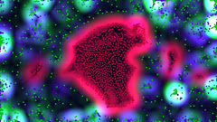
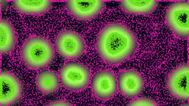
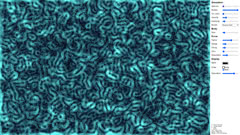
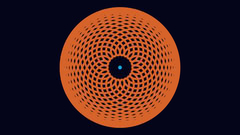
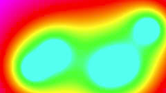

# js-toys

Random Javascript toys.

## nbody

 

_Note: this toy is outdated, see nbody_revisited below._

[live](https://dropfred.github.io/js-toys/nbody/index.html)

Mesmerizing N-body (kind of) toy simulation. Depending of your computer, you may need to reduce the number of bodies in order to have a fluid animation, if too many bodies the animation may be totally stuck.

Interactions between species are random, and some sets are more fun than others. Also, playing with the window size may give some fun results.

## nbody_revisited

  

_Note: this toy requires WebGL 2 for OpenGL ES 3 transform feedback, plus the EXT_color_buffer_float and EXT_float_blend extensions. Extensions are required because vanilla OpenGL ES 3 forbids integer textures blending and rendered float textures._

[live](https://dropfred.github.io/js-toys/nbody_revisited/index.html)

Retake on the n-body toy.

The initial n-body simulation is quite funny, but the very limited number of bodies involved is very frustrating. The two main reasons for that is, first the naive brute force approach with n^2 complexity, and second the fact that drawing to the canvas using the 2d renderer is actually slow. So I decided to test another approach using WebGL 2. The simulation now runs entirely on the GPU, and the complexity is linear. On a computer with a decent graphic card, depending on the settings, more than 300,000 bodies can be simulated at 60 fps, and more than 700,000 bodies at 30 fps, with nearly 0% CPU utilization. Also, it now comes with a lot more parameters to play with. Note that using a totally different method for computing the dynamics, the results are quite different. As a notable difference, collisions are currently not handled in the WebGL version, and this is why attractive forces are not used in this version.

Although absolutely not perfect (there are some severe limitations, and very occasionally some minor bugs), I am quite satisfied with the result. Despite using very basic newtonian physics and crude approximations, results are very organic.

Few explanations for the demo's settings:

- When it makes sense, parameters' units are in pixels for length, and seconds for time. As an example, velocity is expressed in pixels/second.
- The simulation's grow parameter doubles the number of bodies each step up. Be cautious with this one!
- Force decay is the attenuation power. A power of 0 is no decay, 1 is linear, 2 is quadratic, and so on. In practice, 1 works just fine, and 0 may lead to instabilities when the range is low.
- Resolution is the resolution factor used for the force field map. Max resolution is equal to the canvas size, and each step down halfs the resolution. Be cautious with this parameter too, updating force field map is a costly operation. Note that this parameter defaults to the lowest level, and it may lead to visible artifacts, in particular in how the bodies arrange themselves in a squarish manner when the force range is low.

Some tips for a maximum of bodies :
  - Set the number of species to one or two.
  - Use the lowest body size and force resolution.
  - Use bounce border mode.
  - Use a low force range (about 20-30 pixels).

<i>The UI is not designed for mobile devices. However, miniminal support is provided:

- touch and move: adds force
- double tap: resets dynamics (alternate between random and big bang reset mode)
- swipe top: randomizes forces
- swipe bottom: randomizes palette
- swipe left/right: toggle ui and force editor
- zoom: adds/removes bodies

In order to not interfer with the os/browser behaviour about gestures, canvas' action is disabled. It means that you are not able to pan or zoom when inside the canvas. If you are stuck in the canvas after a ui zoom, tap frenetically 5 times, it gives the gesture control back to the browser.</i>

## orbit

 

[live](https://dropfred.github.io/js-toys/orbit/index.html)

Solar system orbits from planets point of view. Originally written using canvas 2d rendering, but end up using WebGL since I couldn't figure out how to trace nice long trails otherwise.

_Disclaimer: This is just a toy, not a realistic simulation. In particular, orbits are assumed circular, and all in the same plane. Also, sizes and distances are obvously not to scale, although relative sizes and distances of planets are approximately realistic (but not the ratio distance / size)._

## blob

[live](https://dropfred.github.io/js-toys/blob/index.html)

Minimalist metaballs toy, no controls whatsoever. It uses WebGL 2 just because it is simpler to draw a quad. For some reasons, the fragment shader loop is incorrectly handled by some mobile devices, I had to unroll it.

## ez-pw

Easy password generator bookmarklet.

## gravity

Game embryo around gravity. The goal is to go from a place to another using gravity assistance.

## ants
