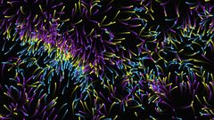
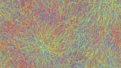

# js-toys

Javascript toys.

## nbody

 

Mesmerizing N-body (kind of) toy simulation. Press s to open settings, z to restart with a new random set, r to change the rendering mode, and c to clear the screen while keeping the current set. Depending of your computer, you may need to reduce the number of bodies in order to have a fluid animation, if too many bodies the animation may be totally stuck.

Interactions between species are random, and some sets are more fun than others. Also, playing with the window size may give some fun results.

## ez-pw

Easy password generator bookmarklet.

## gravity

Game embryo around gravity. The goal is to go from a place to another using gravity assistance.

## ants
